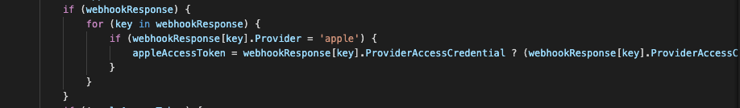

# Apple Access token deletion 
This repository provides details on how to invalidate the apple access token based on LoginRadius AccountDeletion webhook event response https://www.loginradius.com/docs/integrations/webhook/#webhooks.

## Description
This respository provides an (POST) API endpoint which accepts the LoginRadius AccountDeletion webhook event response.

For the Sample AccountDeletion webhook event response please see https://www.loginradius.com/docs/integrations/webhooks/samples/#deleteaccount9

## Installation
Run this command to install the required dependency.
``` bash
npm install 
```
Create a `.env` file in root directory and add following constant
 1. Create an environment variable `client_id` and add the apple client_id, which will be used in apple revoke token API call.
 2. Create an environment variable `client_secret` and add the apple client_secret, which will be used in apple revoke token API call.
 For insights on how to create apple client_secret, please see https://github.com/LoginRadius/apple-client-secret-generator

Run this command to start the server
```bash
npm start
```

### Apple access token deletion endpoint API.
 <br>
 This Api revokes the apple access token received from the user profile

 #### Api Endpoint
 `http://localhost:3000/api/webhook`

### Sample Request Payload


Sample respone: 

#### Output
```json
{
    "description": "",
    "statusCode": 200
}

Note: On success, Apple only returns HTTP code as 200 and does not return any success message/description
```

### Common Error: 
```json
{
    "message": "{\"error\":\"invalid_client\"}",
    "description": "",
    "statusCode": 400,
    "stackTrace": "Error: got 400 response\n    at generateErrorMessage ....."
}

Note: It signifies Apple provided `client_id` and `client_secret` are incorrect/expired.
```

Note: this script consider your apple social provide name as `apple`, if for your LoginRadius App, it social provider is configured with different name then e.g apple_brand1 please replace the same in the /api/webHookController.js file. ScreenShot reference: 


